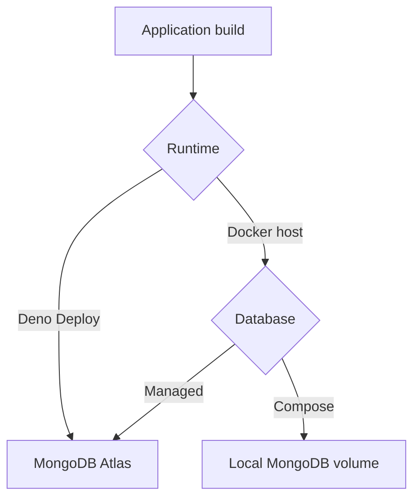

# Deployment

Choose one runtime and one database. The application is the same in every path; the important difference is who runs Node and MongoDB.

- [__Deno Deploy + Atlas__](/deployment/production)

    Managed runtime for a public deployment. Configure `MONGODB_URI` to MongoDB Atlas; Deno Deploy does not run the local Compose database.
- [__Docker + Compose__](/deployment/docker)

    Runs the app and a local MongoDB container together. Protect and back up the database volume.
- [__Production build__](/deployment/production-build)

    Build the client and server for another Node-compatible host, usually with Atlas as the database.

Before going public, set a unique `BETTER_AUTH_SECRET`, use HTTPS origins, configure `MONGODB_URI`, verify email delivery, and run the [security checklist](../reference/security-checklist.md).
